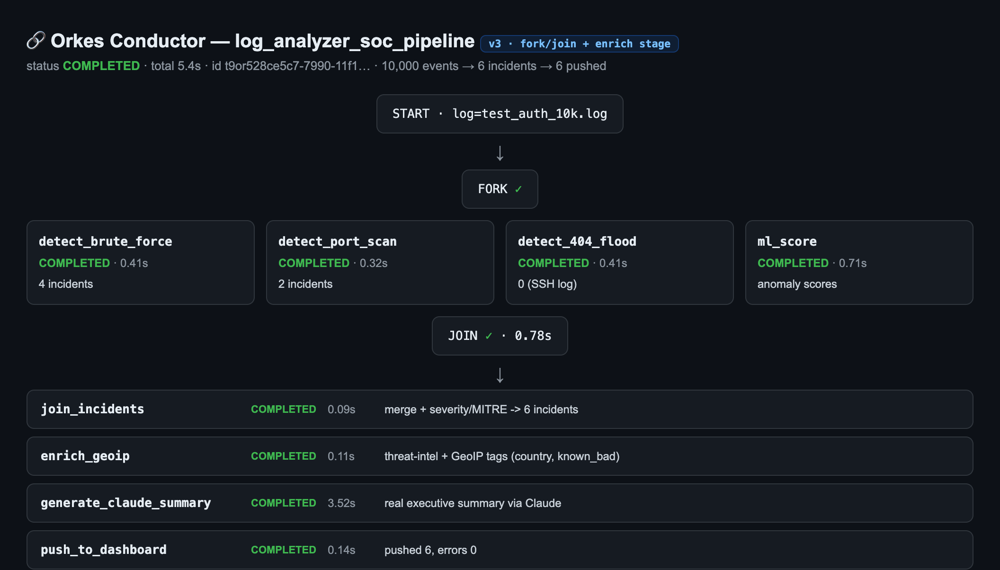
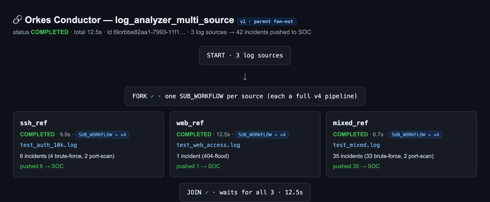

# Orkes Conductor orchestration: log-analyzer → SOC-Dashboard

This wires the log-analyzer detection pipeline and the SOC-Dashboard triage UI into one
durable, retryable, observable workflow on [Orkes Conductor](https://orkes.io). Conductor
hosts the orchestration control plane + UI; the worker code runs on your machine and polls
Conductor for tasks.

```
        ┌──────────────── Orkes Conductor (cloud control plane + UI) ────────────────┐
        │  workflow: log_analyzer_soc_pipeline  (v5, fork/join + enrich + provenance) │
        │                                                                             │
        │            ┌─ detect_brute_force ─┐                                         │
        │   (FORK) ──┼─ detect_port_scan  ──┼── (JOIN) ─► join_incidents              │
        │            ├─ detect_404_flood  ──┤                 │                       │
        │            └─ ml_score          ──┘                 ▼                       │
        │                                          enrich_geoip (threat-intel+GeoIP)  │
        │                                                     │                       │
        │                                                     ▼                       │
        │                              generate_claude_summary ─► push_to_dashboard   │
        └───────▲────────────────────────────────────────────────────▲───────────────┘
                │ poll/complete                                        │
        ┌───────┴────────────────────────────────────────────────────┴───────┐
        │  start_workers.py  (this repo, runs locally, polls Conductor)        │
        └─────────────────────────────────────────────────┬───────────────────┘
                                                           ▼
                                                SOC-Dashboard /api/alerts
```

Three versions are registered on the server. **v1** runs the whole detection pipeline
inside a single `analyze_log` task (a straight three-node line). **v2** forks the three
detectors and the ML scorer into four parallel tasks and joins them — a real DAG with
independently retryable, observable stages. **v3** pulls threat-intel + GeoIP enrichment
out of the join into its own `enrich_geoip` stage, so `join_incidents` only merges and
tags severity/MITRE (cheap, local), and the enrichment lookups are separately timed and
retryable. **v4** enriches each incident dict in place inside `enrich_geoip` — merging the
per-IP anomaly score and a flat `mitre_id` so one incident carries severity, MITRE, GeoIP,
threat-intel, and anomaly score together — and returns aggregate stats (known-bad count,
countries, scored) so the task panel shows substance. **v5** attaches run provenance to
every pushed alert — the workflow id (wired from `${workflow.workflowId}`) plus a
best-effort per-task timing blob that `push_to_dashboard` reads back from Conductor — so
the SOC-Dashboard can trace each alert to the run that produced it and how long each stage
took. Each fork branch re-parses the log locally so only small incident lists (never the
raw events) cross a task boundary.

## A live run

Below is a real **v3** run of `log_analyzer_soc_pipeline` against a 10,000-event SSH log.
The three detectors and the ML scorer run in parallel off the fork; the join merges and
tags them into six incidents; `enrich_geoip` adds threat-intel + GeoIP as its own stage;
Claude writes an executive summary; and the six incidents are pushed to the SOC-Dashboard —
the whole DAG completing in about five seconds.



End to end, from the Conductor run to the incidents landing in the analyst's queue:


With `ANTHROPIC_API_KEY` set, `generate_claude_summary` returns a real executive summary.
A representative excerpt from the run above:

> Our organization detected five distinct attack sources conducting reconnaissance and
> credential compromise attempts, with the most severe threat originating from 10.99.99.99,
> which executed 783 brute-force login attempts (MITRE T1110.001 - Credential Stuffing)…
> Recommended immediate actions: (1) block all identified IPs at the firewall and implement
> rate-limiting on authentication endpoints, (2) enforce MFA across all accounts…

The stage is still optional: it returns `null` — without failing the workflow — when the
key is unset *or* invalid, so the downstream SOC push always runs.

By the time an incident reaches `push_to_dashboard` it carries every computed field in one
place — as of v4, severity, MITRE (nested + flat `mitre_id`), GeoIP, threat-intel, and the
per-IP anomaly score together:

```json
{
  "incident_type": "brute_force",
  "source_ip": "10.99.99.99",
  "severity": "CRITICAL",
  "mitre_id": "T1110.001",
  "mitre": { "id": "T1110.001", "name": "Brute Force: Password Guessing", "tactic": "Credential Access" },
  "country": "Unknown",
  "known_bad": false,
  "anomaly_score": 1.0,
  "event_count": 783
}
```

`anomaly_score` is `null` when the ML stage did not score that IP — honest, not an error.
`enrich_geoip` also returns aggregate stats (`enriched`, `known_bad_count`, `countries`,
`scored`) so its Orkes task panel shows a rollup rather than just the incident list.

## Fan-out across log sources

`log_analyzer_multi_source` (v1) is a parent workflow that runs the v4 pipeline as a
sub-workflow once per log source, in parallel, then joins. One manual trigger fans out to
three independent executions — an SSH log, a web log, and a mixed log — so all three
detector types (brute-force, port-scan, 404-flood) are exercised across the sources, and
each source's incidents are pushed to the SOC-Dashboard by its own sub-workflow.



Each branch is a Conductor `SUB_WORKFLOW` task pointing at `log_analyzer_soc_pipeline`
version 4; the `JOIN` waits for all three before the parent completes. No new workers are
needed — the sub-workflows reuse the v4 workers. Register it alongside the pipeline with
`register_conductor.py`, then trigger it with three `log_*` inputs plus `soc_url` /
`soc_api_key`.

### Scheduling (not built)

Orkes can also run a workflow on a cron-style schedule via its Scheduler, which would give a
history of runs over time. This is intentionally **not** wired up here: a recurring schedule
fires unattended, and since each firing runs the full pipeline it would make real Claude API
calls and push alerts to the SOC on a timer whether or not anyone is watching — recurring
cost with little value for a one-shot live demo. If it were added, it would use the SDK's
`OrkesSchedulerClient` (a `save_schedule` call with a cron expression targeting
`log_analyzer_multi_source`) and be torn down with `delete_schedule(name)` (or paused) so
nothing runs unattended. The manual fan-out above is the substantive, on-demand half.

## Files

| File | Purpose |
|------|---------|
| `conductor_workers.py` | `@worker_task` adapters wrapping existing pipeline functions (no detection logic changed): `analyze_log` (v1), plus `detect_brute_force` / `detect_port_scan` / `detect_404_flood` / `ml_score` / `join_incidents` (v2 fork/join), plus `generate_claude_summary` and `push_to_dashboard` (shared). |
| `start_workers.py` | Launches the workers (thread-per-worker; see the macOS note below). |
| `register_conductor.py` | One-time registration of the task defs + workflow on the server. |
| `conductor_workflow.json` | The core pipeline workflow definition (v4; also importable via the Orkes UI). |
| `conductor_multi_source.json` | The `log_analyzer_multi_source` parent fan-out workflow (SUB_WORKFLOW per log source). |
| `requirements-conductor.txt` | The `conductor-python` SDK dependency. |

## Worker stages

1. **`analyze_log(log_path, log_format="auto", enrich_ip=True, run_ml=True)`** — parse →
   detect (brute-force / port-scan / 404-flood) → severity+MITRE → optional GeoIP/threat-intel
   → optional IsolationForest scoring. Returns a JSON-safe list of `incidents` (a few hundred
   dicts) plus `counts` and `anomaly_scores`. Raw events (which carry `datetime`s and can be
   hundreds of thousands of rows) stay inside this worker and never cross a task boundary.
2. **`generate_claude_summary(incidents, anomaly_scores)`** — a 3-sentence SOC exec summary via
   the Claude API. Returns `summary=None` (no error) if `ANTHROPIC_API_KEY` is unset.
3. **`push_to_dashboard(incidents, soc_url, soc_api_key)`** — POSTs each incident to
   SOC-Dashboard's `/api/alerts` (needs the `X-API-Key` matching SOC's `ALERTS_API_KEY`).

## Setup

```bash
cd log-analyzer
python3 -m venv .venv
./.venv/bin/pip install -r requirements.txt -r requirements-conductor.txt

# Orkes Developer Edition credentials (Settings → API Keys in the Orkes UI)
export CONDUCTOR_SERVER_URL="https://developer.orkescloud.com/api"
export CONDUCTOR_AUTH_KEY="<your-key-id>"
export CONDUCTOR_AUTH_SECRET="<your-key-secret>"

# Optional
export ANTHROPIC_API_KEY="<claude-key>"     # enables the summary stage
```

## Run

```bash
# 1. Register task defs + workflow on the server (idempotent, one time)
./.venv/bin/python register_conductor.py

# 2. Start SOC-Dashboard (separate terminal, so the push has a target)
cd ../SOC-Dashboard
FLASK_SECRET_KEY=$(python3 -c 'import secrets;print(secrets.token_hex(32))') \
ALERTS_API_KEY=demo-soc-key \
DATABASE_URL=postgresql://localhost/soc_dashboard \
PORT=8000 ./.venv/bin/python app.py

# 3. Start the workers (they poll Conductor until Ctrl-C)
cd ../log-analyzer
./.venv/bin/python start_workers.py

# 4. Trigger a run — from the Orkes UI (Run Workflow → log_analyzer_soc_pipeline) with input:
#      { "log_path": "/abs/path/to/test_auth.log",
#        "soc_url": "http://localhost:8000/api/alerts",
#        "soc_api_key": "demo-soc-key" }
#    …or from Python:
./.venv/bin/python - <<'PY'
import os
from conductor.client.configuration.configuration import Configuration
from conductor.client.orkes.orkes_workflow_client import OrkesWorkflowClient
from conductor.client.http.models.start_workflow_request import StartWorkflowRequest
wf = OrkesWorkflowClient(Configuration())
run = wf.execute_workflow(StartWorkflowRequest(
    name="log_analyzer_soc_pipeline", version=1,
    input={"log_path": os.path.abspath("test_auth.log"),
           "soc_url": "http://localhost:8000/api/alerts",
           "soc_api_key": "demo-soc-key"}), wait_for_seconds=60)
print(run.status, run.output)
PY
```

Watch the run flow through the three stages in the Orkes UI; the pushed incidents appear in
the SOC-Dashboard open-alerts queue.

## Gotchas discovered while building this

- **macOS + Python 3.14 → use the thread runner.** The SDK's default `TaskHandler` spawns
  each worker in its own OS process; on macOS + Python 3.14 those subprocesses segfault
  (exit code -11) on the first poll. `start_workers.py` runs each worker in a *thread* via
  `TaskRunner` instead — same polling behavior, one stable process.
- **Worker type hints must be real, non-parameterized types.** The SDK deserializes task
  inputs from the function's annotations. Do **not** use `from __future__ import annotations`
  (it stringifies them and breaks `isinstance`). A **list** parameter must be typed
  `List[dict]` (the SDK calls `typing.get_args(annotation)[0]`, so bare `list` throws
  `IndexError`); scalars/dicts are fine bare; avoid `dict | None` (use `dict` + `None` default).
- **Keep big/`datetime` payloads inside a worker.** Conductor serializes every task
  input/output to JSON. Parsed events aren't JSON-safe (datetimes) and can be huge, so only
  the small incident list crosses task boundaries, with its datetimes converted to ISO strings.
- **DB is optional in the workflow.** `analyze_log` does not write to Postgres; the CLI's
  `--no-db` DB persistence path is separate. The workflow's persistence is the SOC push.
