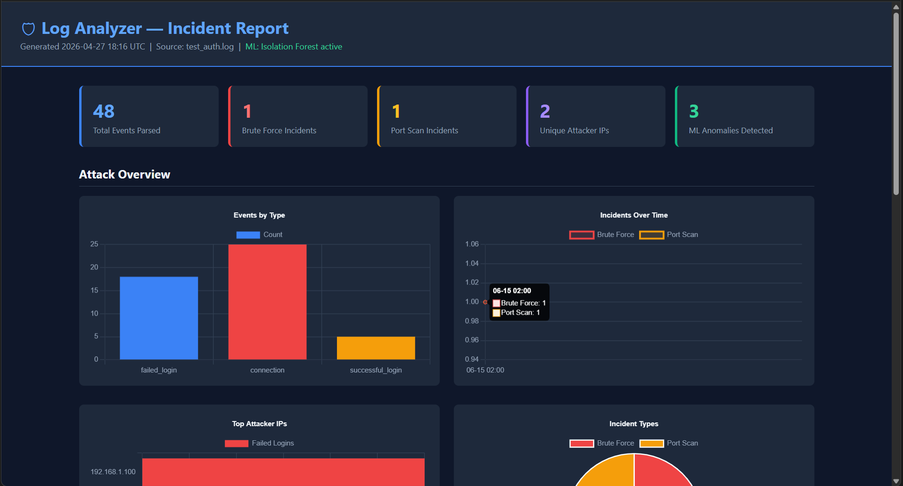
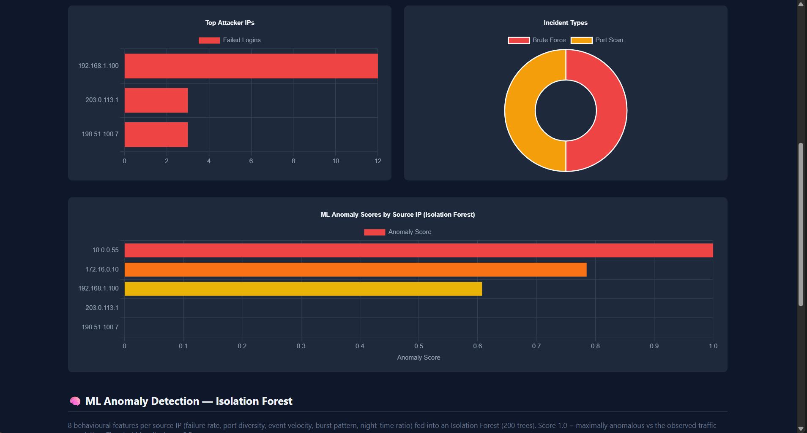
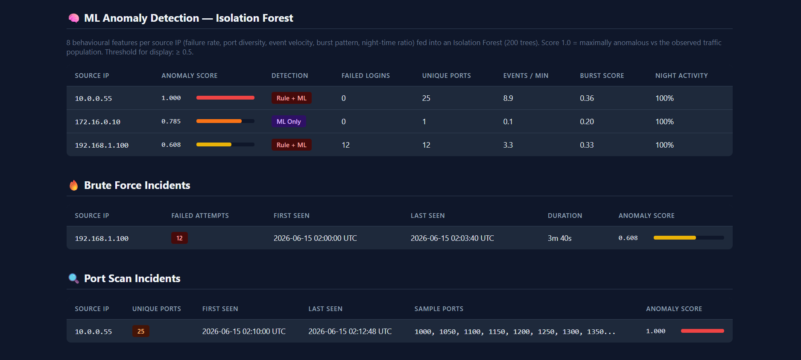

   

# log-analyzer

A CLI security tool that parses SSH `auth.log` and Windows Event Log CSV files, detects attacks with rule-based and ML detection, maps findings to MITRE ATT&CK, and generates a dark-themed HTML incident report.

## Features

- **Rule-based detection** — sliding-window brute-force, port scan, and 404-flood alerts
- **ML anomaly detection** — Isolation Forest on 8 behavioural features per source IP; catches low-and-slow attackers rules miss
- **MITRE ATT&CK mapping** — every incident tagged with technique ID, tactic, and documentation link
- **Rich CLI** — colour-coded tables, severity badges (CRITICAL/HIGH/MEDIUM/LOW), and live progress bars
- **Claude AI summaries** — 3-sentence SOC executive summary via the Anthropic API (`--ai-summary`)
- **HTML reports** — Chart.js dashboards: timeline, top-attacker IPs, event breakdown, ML anomaly scores
- **Docker support** — `docker compose up` spins up Postgres + analyzer together
- **GitHub Actions CI** — runs all 61 pytest tests and uploads a sample report on every push

## Prerequisites

| Requirement | Version | Notes |
|---|---|---|
| Python | 3.12+ | |
| PostgreSQL | 14+ | Optional — use `--no-db` to skip |
| Anthropic API key | — | Optional — only needed for `--ai-summary` |

## Skills Demonstrated

| Area | Details |
|---|---|
| Security Detection | Sliding-window brute-force, port scan, and 404-flood rule engine |
| ML / Anomaly Detection | Isolation Forest on 8 behavioural features; catches low-and-slow attacks |
| MITRE ATT&CK | Technique mapping (T1110.001, T1046), tactic labelling, clickable report links |
| PostgreSQL | Schema design, psycopg2 batch inserts, JSONB incident details |
| Docker | Multi-service Compose with health-checked Postgres and volume mounts |
| CI/CD | GitHub Actions: pytest gate + HTML report artifact on every push |

## Demo

```
┌─────────────────────────────────────────────────────────────────────┐
│  Log Analyzer  │  test_auth_10k.log  │  format: ssh  │  10,000 lines │
└─────────────────────────────────────────────────────────────────────┘
[+] Parsed 10,000 events  (10,000 lines)
[*] Running rule-based detections...

                          Detected Incidents
╭──────────────┬─────────────────┬───────┬──────────┬────────────────────╮
│ Type         │ Source IP       │ Count │ Severity │ MITRE ID           │
├──────────────┼─────────────────┼───────┼──────────┼────────────────────┤
│ Brute Force  │ 10.99.99.99     │  2311 │ CRITICAL │ T1110.001          │
│ Port Scan    │ 10.99.99.99     │   512 │ CRITICAL │ T1046              │
│ Port Scan    │ 198.51.100.77   │    87 │ HIGH     │ T1046              │
│ Port Scan    │ 203.0.113.42    │    54 │ MEDIUM   │ T1046              │
│ Brute Force  │ 185.220.101.45  │   430 │ CRITICAL │ T1110.001          │
│ Brute Force  │ 45.33.32.156    │   218 │ CRITICAL │ T1110.001          │
│ Brute Force  │ 198.199.119.48  │    97 │ HIGH     │ T1110.001          │
╰──────────────┴─────────────────┴───────┴──────────┴────────────────────╯

  MITRE ATT&CK Coverage
  T1110.001  Brute Force: Password Guessing  Credential Access  (4 incidents)
  T1046      Network Service Discovery       Discovery          (3 incidents)

[+] Isolation Forest — 4 IPs above threshold 0.5
  10.99.99.99    score=1.0000  Rule + ML
  91.108.4.200   score=0.6196  ML Only
  172.16.0.0     score=0.6111  ML Only
  203.0.113.42   score=0.5067  Rule + ML

[+] Report written: report.html
```

## Quick start

```bash
pip install -r requirements.txt
```

No database:
```bash
python log_analyzer.py auth.log --no-db --report report.html
```

With PostgreSQL:
```bash
python log_analyzer.py auth.log --report report.html
```

With Claude AI executive summary:
```bash
export ANTHROPIC_API_KEY=sk-...
python log_analyzer.py auth.log --no-db --ai-summary --report report.html
```

Via Docker (place log at `./logs/auth.log`, report appears in `./reports/`):
```bash
docker compose up
```

## CLI flags

| Flag | Default | Description |
|---|---|---|
| `--report FILE` | `incident_report.html` | Output HTML report path |
| `--no-db` | — | Skip PostgreSQL storage |
| `--no-ml` | — | Skip Isolation Forest |
| `--ai-summary` | — | Generate Claude AI executive summary |
| `--ml-threshold FLOAT` | `0.5` | Minimum anomaly score to display |
| `--brute-force-threshold N` | `5` | Failed logins to trigger alert |
| `--brute-force-window MIN` | `10` | Sliding window in minutes |
| `--port-scan-threshold N` | `20` | Unique ports to trigger alert |
| `--port-scan-window MIN` | `5` | Sliding window in minutes |
| `--format {ssh,windows,auto}` | `auto` | Log format override |
| `--init-schema` | — | Create database schema and exit |

## HTML Report

*Summary cards and Chart.js attack overview*


*Top attacker IPs, incident breakdown, and ML anomaly scores*


*Isolation Forest feature table with Brute Force and Port Scan incident details*


## Project Structure

```
log-analyzer/
├── log_analyzer.py        # Main CLI — parsing, detection, ML, report generation
├── ai_summary.py          # Claude API executive summary integration
├── generate_test_logs.py  # Synthetic SSH + Windows log generator
├── schema.sql             # PostgreSQL schema (log_events, incidents)
├── requirements.txt       # Python dependencies
├── config.example.yaml    # All detection thresholds and allowlist options
├── Dockerfile             # Container image
├── docker-compose.yml     # Postgres + analyzer services
├── tests/
│   └── test_detection.py  # 61 pytest unit tests
└── .github/workflows/
    └── ci.yml             # GitHub Actions: test + report artifact
```

## Running tests

```bash
python -m pytest tests/ -v
```

## License

MIT
